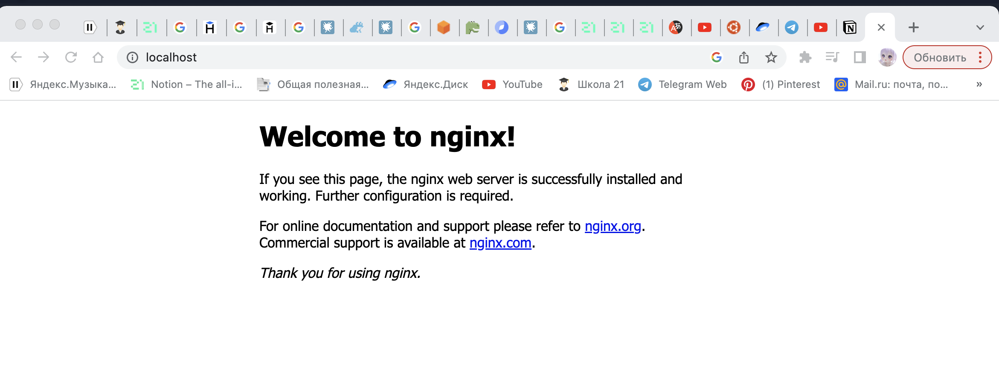
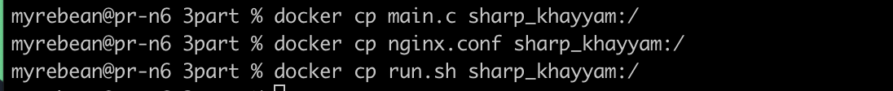

## Part 1. Готовый докер

- Взять официальный докер образ с **nginx** и выкачать его при помощи `docker pull`
  
- Проверить наличие докер образа через `docker images`
  
- Запустить докер образ через `docker run -d [image_id|repository]`
  
- Проверить, что образ запустился через `docker ps`
  
- Посмотреть информацию о контейнере через `docker inspect [container_id|container_name]`
  
- По выводу команды определить и поместить в отчёт размер контейнера, список замапленных портов и ip контейнера
  - "ShmSize": 67108864 - Размер контейнера
  - "ExposedPorts":"80/tcp" - Список замапленных портов
  - "IPAddress": "172.17.0.3" - IP контейнера
- Остановить докер образ через `docker stop [container_id|container_name]`
  
- Проверить, что образ остановился через `docker ps`
  
- Запустить докер с замапленными портами 80 и 443 на локальную машину через команду *run*
  
- Проверить, что в браузере по адресу *localhost:80* доступна стартовая страница **nginx**
  
- Перезапустить докер контейнер через `docker restart [container_id|container_name]`
  
- Проверить любым способом, что контейнер запустился
  

  ## Part 2. Операции с контейнером

- Прочитать конфигурационный файл *nginx.conf* внутри докер контейнера через команду *exec*
  
- Создать на локальной машине файл *nginx.conf*
- Настроить в нем по пути */status* отдачу страницы статуса сервера **nginx**
  
- Скопировать созданный файл *nginx.conf* внутрь докер образа через команду `docker cp`
  
- Перезапустить **nginx** внутри докер образа через команду *exec*
  
- Проверить, что по адресу *localhost:80/status* отдается страничка со статусом сервера **nginx**
  
- Экспортировать контейнер в файл *container.tar* через команду *export*
  
- Остановить контейнер
  
- Удалить образ через `docker rmi [image_id|repository]`, не удаляя перед этим контейнеры
  
- Удалить остановленный контейнер
  
- Импортировать контейнер обратно через команду *import*
  
- Запустить импортированный контейнер
  
- Проверить, что по адресу *localhost:80/status* отдается страничка со статусом сервера **nginx**
  
  

## Part 3. Мини веб-сервер

- Написать мини сервер на **C** и **FastCgi**, который будет возвращать простейшую страничку с надписью `Hello World!`
- Запускаем nginx контейнер с портом 81.
  
- Устанавливаем в него: `apt install libfcgi-dev`, `apt install spawn-fcgi`, `apt install gcc`
- Перекидываем нужные нам файлы в контейнер
  
Даём права скрипту и запускаем run.sh
- Проверить, что в браузере по *localhost:81* отдается написанная вами страничка
  
- Положить файл *nginx.conf* по пути *./nginx/nginx.conf* (это понадобится позже)
  

## Part 4. Свой докер

- Собрать написанный докер образ через `docker build` при этом указав имя и тег
  
- Запустить собранный докер образ с маппингом 81 порта на 80 на локальной машине и маппингом папки *./nginx* внутрь контейнера по адресу, где лежат конфигурационные файлы **nginx**'а
  
- Проверить, что по localhost:80 доступна страничка написанного мини сервера
  
- Дописать в *./nginx/nginx.conf* проксирование странички */status*, по которой надо отдавать статус сервера **nginx**
- Проверить, что теперь по *localhost:80/status* отдается страничка со статусом **nginx**
  

## Part 5. **Dockle**

- Установить dockle через brew
  
- Просканировать образ из предыдущего задания через `dockle [image_id|repository]`
  
- Исправить образ так, чтобы при проверке через **dockle** не было ошибок и предупреждений
- Нужно рописать в терминале  *export DOCKER_CONTENT_TRUST=1* и запускать dockle с флагами
  

## Part 6. Базовый **Docker Compose**

- Написать файл *docker-compose.yml*
- `docker-compose build`
  
- `docker-compose up`
  
- Проверить, что в браузере по localhost:80 отдается написанная вами страничка, как и ранее
  
  